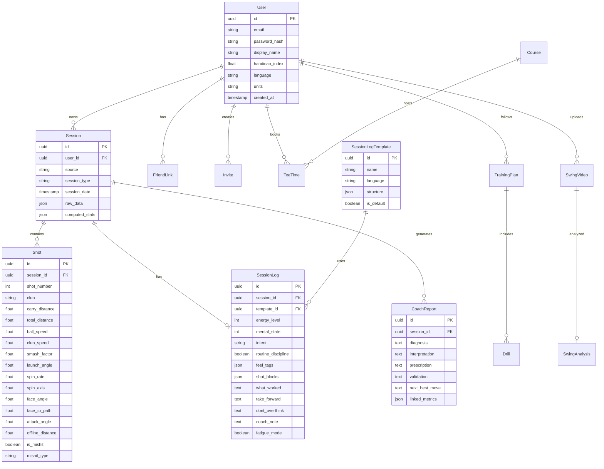

# StrikeLab Golf - Full Monorepo Scaffold Plan

## Repository Structure

```
/
├── PLAN.md                    # Architecture documentation
├── README.md                  # Setup + deployment guide
├── .gitignore
├── apps/
│   ├── web/                   # React + Vite + TypeScript frontend
│   │   ├── package.json
│   │   ├── vite.config.ts
│   │   ├── tailwind.config.ts
│   │   ├── tsconfig.json
│   │   ├── index.html
│   │   ├── public/
│   │   └── src/
│   │       ├── main.tsx
│   │       ├── App.tsx
│   │       ├── index.css         # Tailwind + design tokens
│   │       ├── i18n/             # Bilingual translations
│   │       │   ├── index.ts
│   │       │   ├── en.json
│   │       │   └── no.json
│   │       ├── stores/           # Zustand stores
│   │       │   ├── authStore.ts
│   │       │   ├── settingsStore.ts (units + language)
│   │       │   └── sessionStore.ts
│   │       ├── api/              # TanStack Query hooks
│   │       │   ├── client.ts
│   │       │   ├── auth.ts
│   │       │   ├── sessions.ts
│   │       │   ├── logs.ts
│   │       │   └── coach.ts
│   │       ├── components/
│   │       │   ├── ui/           # Design system primitives
│   │       │   ├── layout/       # Shell, Sidebar, Nav
│   │       │   ├── charts/       # Recharts + dispersion
│   │       │   └── cards/        # Premium card variants
│   │       ├── pages/
│   │       │   ├── Dashboard.tsx
│   │       │   ├── Sessions.tsx
│   │       │   ├── SessionDetail.tsx
│   │       │   ├── SessionLog.tsx
│   │       │   ├── Connectors.tsx
│   │       │   ├── CoachReport.tsx
│   │       │   ├── TrainingPlan.tsx
│   │       │   ├── SwingLab.tsx
│   │       │   ├── Calendar.tsx
│   │       │   ├── Friends.tsx
│   │       │   ├── Login.tsx
│   │       │   └── Register.tsx
│   │       └── lib/
│   │           ├── utils.ts
│   │           └── constants.ts
│   │
│   └── api/                   # FastAPI backend
│       ├── requirements.txt
│       ├── alembic.ini
│       ├── alembic/
│       │   └── versions/
│       ├── app/
│       │   ├── main.py
│       │   ├── config.py
│       │   ├── database.py
│       │   ├── models/           # SQLAlchemy models
│       │   │   ├── __init__.py
│       │   │   ├── user.py
│       │   │   ├── session.py
│       │   │   ├── shot.py
│       │   │   ├── log.py
│       │   │   ├── coach.py
│       │   │   ├── course.py
│       │   │   └── training.py
│       │   ├── schemas/          # Pydantic schemas
│       │   ├── routers/          # API routes
│       │   │   ├── auth.py
│       │   │   ├── sessions.py
│       │   │   ├── logs.py
│       │   │   ├── connectors.py
│       │   │   ├── coach.py
│       │   │   ├── courses.py
│       │   │   └── friends.py
│       │   ├── services/
│       │   │   ├── auth.py
│       │   │   ├── coach_engine.py
│       │   │   └── connectors/
│       │   │       ├── base.py
│       │   │       ├── trackman.py
│       │   │       ├── topgolf.py
│       │   │       ├── foresight.py
│       │   │       └── csv_importer.py
│       │   └── seed/
│       │       ├── demo_data.py
│       │       └── templates.py
│       └── Dockerfile
│
├── data/
│   └── sample_session.csv        # Demo import file
└── docker-compose.yml            # Local dev environment
```

---

## Database Schema Overview



---

## UI Routes and Sidebar Navigation

| Route | Page | Sidebar Label |

|-------|------|---------------|

| `/` | Dashboard | Home |

| `/sessions` | Sessions List | Sessions |

| `/sessions/:id` | Session Detail | - |

| `/sessions/:id/log` | Session Log Form | - |

| `/connectors` | Connectors Hub | Connectors |

| `/coach` | Coach Reports | Coach |

| `/training` | Training Plan | Training |

| `/swing-lab` | Swing Lab | Swing Lab |

| `/calendar` | Calendar + Tee Times | Calendar |

| `/friends` | Friends + Compare | Friends |

| `/login` | Login | - |

| `/register` | Register | - |

Sidebar: Dark obsidian panel, Electric Cyan active indicator, language toggle in footer.

---

## Connector Architecture


Each connector implements `BaseConnector` with methods:

- `parse_raw(data) -> NormalizedSession`
- `map_club_names(raw_club) -> StandardClub`
- `extract_shots(data) -> List[NormalizedShot]`

---

## Session Log Template Schema

```json
{
  "id": "uuid",
  "name": "ØKT 1 – LOGG",
  "language": "no",
  "structure": {
    "pre_session": {
      "energy": { "type": "scale", "min": 1, "max": 5 },
      "mental_state": { "type": "scale", "min": 1, "max": 5 },
      "intent": { "type": "text", "placeholder": "Hva trener du på?" },
      "routine_discipline": { "type": "boolean" },
      "feel_tags": { "type": "tags", "options": ["rolig", "tung", "sen", "stress", "fokusert"] }
    },
    "shot_blocks": [
      { "name": "Oppvarming", "fields": ["hit_target", "miss_pattern"] },
      { "name": "Hovedøkt", "fields": ["hit_target", "miss_pattern", "notes"] }
    ],
    "post_session": {
      "what_worked": { "type": "text" },
      "take_forward": { "type": "text" },
      "dont_overthink": { "type": "text" },
      "coach_note": { "type": "text" }
    },
    "fatigue_mode": true
  }
}
```

Templates seeded in both Norwegian (ØKT 1 – LOGG, ØKT 1 – NYÅRSPLAN) and English (SESSION 1 – LOG, SESSION 1 – NEW YEAR PLAN).

---

## Coach Report Flow


---

## Bilingual i18n Strategy

- Library: `i18next` + `react-i18next`
- Files: `src/i18n/en.json`, `src/i18n/no.json`
- Global toggle in Zustand `settingsStore` → persisted to localStorage
- Toggle UI: Language pill in sidebar footer (EN | NO)

Structure:

```json
{
  "nav": { "home": "Home", "sessions": "Sessions", ... },
  "dashboard": { "title": "Welcome back", "strike_score": "Strike Score", ... },
  "log": { "energy": "Energy Level", "mental_state": "Mental State", ... },
  "coach": { "diagnosis": "Diagnosis", "prescription": "Prescription", ... }
}
```

---

## Deployment Plan

| Component | Platform | Config |

|-----------|----------|--------|

| Frontend | Vercel | Auto-deploy from `apps/web`, env: `VITE_API_URL` |

| Backend | Fly.io or Render | Docker deploy from `apps/api`, env: `DATABASE_URL`, `SECRET_KEY` |

| Database | Supabase | PostgreSQL free tier, connection pooler enabled |

Environment Variables:

- Frontend: `VITE_API_URL`
- Backend: `DATABASE_URL`, `SECRET_KEY`, `CORS_ORIGINS`, `DEBUG`

---

## Design System Tokens

```css
:root {
  /* Colors */
  --color-obsidian: #0A0A0F;
  --color-graphite: #141419;	
  --color-surface: #1A1A22;
  --color-border: rgba(255, 255, 255, 0.08);
  --color-ice-white: #F4F4F6;
  --color-muted: #8A8A99;
  --color-cyan: #23D5FF;
  --color-cyan-glow: rgba(35, 213, 255, 0.3);
  
  /* Typography */
  --font-sans: 'Inter', system-ui, sans-serif;
  --font-display: 'Inter Tight', 'Inter', sans-serif;
  
  /* Spacing */
  --radius-card: 20px;
  --radius-button: 12px;
  
  /* Shadows */
  --shadow-card: 0 8px 32px rgba(0, 0, 0, 0.4);
  --shadow-glow: 0 0 24px var(--color-cyan-glow);
  
  /* Motion */
  --transition-fast: 150ms ease;
  --transition-normal: 250ms ease;
}
```

---

## Files to Generate

### Root Level (5 files)

- `PLAN.md` - This architecture document
- `README.md` - Setup and deployment guide
- `.gitignore` - Standard ignores
- `docker-compose.yml` - Local PostgreSQL
- `data/sample_session.csv` - Demo import file

### Frontend `/apps/web` (~35 files)

- Config: `package.json`, `vite.config.ts`, `tailwind.config.ts`, `tsconfig.json`, `index.html`
- Core: `main.tsx`, `App.tsx`, `index.css`
- i18n: `index.ts`, `en.json`, `no.json`
- Stores: `authStore.ts`, `settingsStore.ts`, `sessionStore.ts`
- API: `client.ts`, `auth.ts`, `sessions.ts`, `logs.ts`, `coach.ts`
- Components: ~15 UI components (Button, Card, Input, Sidebar, Nav, Charts, etc.)
- Pages: 12 page components

### Backend `/apps/api` (~30 files)

- Config: `requirements.txt`, `alembic.ini`, `Dockerfile`
- Core: `main.py`, `config.py`, `database.py`
- Models: 10 SQLAlchemy models
- Schemas: Pydantic schemas for each entity
- Routers: 7 router modules
- Services: Auth, Coach Engine, 5 connector modules
- Seed: Demo data + templates

---

## First-Week Milestones

| Day | Milestone |

|-----|-----------|

| 1 | Repo scaffold complete, local dev running, DB migrations done |

| 2 | Auth flow (register/login) working, basic dashboard shell |

| 3 | CSV connector + Session/Shot import, session list page |

| 4 | Session detail + dispersion chart, shot table with filters |

| 5 | Session log template system, log form UI |

| 6 | Coach report generation, premium report cards |

| 7 | Deploy to Vercel + Fly.io, polish, demo data visible |