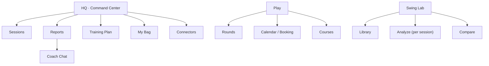
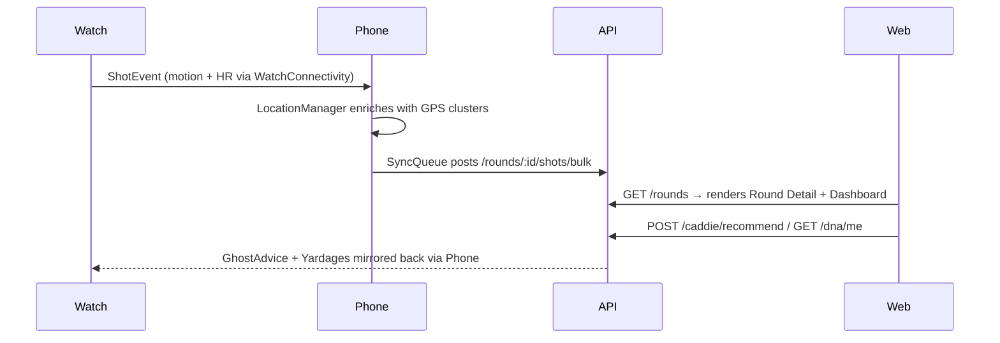

# StrikeLab — Architecture Plan

## Overview

StrikeLab is a unified golf performance platform that ties together a personal
trainer, AI coach, on-course caddie, booking system, and an Apple Watch
companion. Everything routes through one backend, shares one design system, and
serves a single mental model: **diagnose → prescribe → validate**.

## Repository Layout

```
StrikeLab/
├── apps/
│   ├── web/                 React + Vite + TypeScript (TanStack Query, i18n)
│   ├── api/                 FastAPI + SQLAlchemy + Alembic
│   ├── ios/                 SwiftUI iPhone Caddie (CoreLocation, MapKit, WatchConnectivity)
│   └── watch/               SwiftUI Apple Watch app (HealthKit, CoreMotion, Crown)
├── packages/
│   ├── design-tokens/       CSS variables + JSON twin
│   ├── design-swift/        Swift Package mirroring the tokens
│   └── domain/              Shared TypeScript domain types
├── _archive/                Legacy snapshots (StrikeLab_Analyze, StrikeLab_Caddie)
├── docs/                    Reference + design files
├── data/                    Sample CSVs
├── docker-compose.yml       Local Postgres
├── pnpm-workspace.yaml      Web + packages workspace
└── README.md
```

## Design System — Performance Instrument

Source: `StrikelabDesign/primitives.jsx` ported into `packages/design-tokens`.

### Colors (dark, default)

| Token | Value |
|---|---|
| `--bg` | `#0A0B0A` |
| `--surface-solid` | `#151816` |
| `--line-strong` | `#2D322F` |
| `--ink` | `#EDE8DE` |
| `--ink-2` | `#B9B6AC` |
| `--ink-3` | `#76746B` |
| `--accent` (Signal Lime) | `oklch(0.88 0.18 125)` |
| `--warn` | `oklch(0.78 0.16 65)` |
| `--bad` | `oklch(0.68 0.20 28)` |

A light theme (`[data-theme="light"]`) is defined for parity but secondary in QA.

### Type

- **Geist** for UI / display.
- **Instrument Serif (italic)** for emphasis (`<em>` inside display strings).
- **Geist Mono** for numbers, micro labels, mono captions.
- Scale: DISPLAY-XL 96 / DISPLAY-L 64 / DISPLAY-M 40 / HEAD 24 / BODY 15 / MICRO 10.

### Motion

- **launch** `cubic-bezier(0.2, 0.9, 0.3, 1)` 240ms
- **settle** `cubic-bezier(0.16, 1, 0.3, 1)` 480ms
- **trace** `cubic-bezier(0.65, 0, 0.35, 1)` 900ms
- **micro** `ease-out` 120ms
- `prefers-reduced-motion` respected by tokens + global CSS.

### Components (web)

`apps/web/src/components/ui/`

- `Panel`, `Brackets` — flat hairline-bordered card primitive
- `Stat` — micro label + big mono number + delta
- `Tag` — bordered ALL-CAPS chip (default / accent / warn / bad)
- `Spark` — tiny SVG sparkline
- `SLLogo` — reticule + wordmark
- `Button`, `IconButton`, `PillButton`, `MotionButton` — mono uppercase actions
- `Card`, `MetricCard`, `FeatureCard` — kept API-compatible, restyled

### Components (Swift)

`packages/design-swift/Sources/StrikeLabDesign/`

- `SLColors`, `SLTypography`, `SLPanel`, `SLTag`, `SLStat`, `SLLogo`

The iOS app's `Theme.swift` keeps the old `nordic*` aliases pointing at the new
tokens so existing screens migrate progressively.

## Information Architecture



## Backend Surfaces

| Router | Prefix | Purpose |
|---|---|---|
| auth | `/auth` | JWT + refresh + invites + profile |
| sessions | `/sessions` | Range / sim / course sessions, CSV import, shots |
| logs | `/log` | Templates + structured session logs |
| connectors | `/connectors` | Source registry + import jobs |
| coach | `/coach` | Reports + chat |
| courses | `/courses` | Course catalog + tee times |
| friends | `/friends` | Social roster + invites |
| equipment | `/equipment` | Bags, clubs, per-club stats |
| training | `/training` | Plans + drill library |
| rounds | `/rounds` | On-course rounds + bulk shot sync from iOS |
| caddie | `/caddie` | Ghost Caddie advice |
| dna | `/dna` | Shot DNA aggregation |
| booking | `/booking` | Tee-time search / hold / confirm |

Migrations: alembic versions 001 → 005. The 005 revision adds `rounds`,
`round_shots`, `player_shot_dna`, `ghost_advice`.

## iOS + Watch

- iOS canonical project lives at `apps/ios/StrikeLabCaddie.xcodeproj`. It
  layers Shot DNA / Ghost Caddie / Round Insights from the legacy "DNA-aware"
  branch on top of the more complete (Player / Course / GPS / WHS handicap)
  base tree.
- `apps/ios/StrikeLabCaddie/Networking/APIClient.swift` plus `SyncQueue.swift`
  push rounds and shots to `/rounds/...` whenever the device is online; queued
  payloads persist across launches.
- The watch ships six new SwiftUI screens in
  `apps/watch/StrikeLabCaddieWatch Watch App/Views/Caddie/`:
  HoleOverview, ClubPicker, PreShotIntent, LiveShot, HoleMap, RoundSummary.
  Crown drives in-screen scrub; tap commits.

## Data Flow



## Deferred / Phase-2 Items

- **Real booking provider OAuth** (GolfBox, ChronoGolf, 1Golf) — the current
  `/booking` router ships search + manual confirm; provider integrations are
  stubbed.
- **AI Gateway LLM** — coach chat + Ghost Caddie advice are rule-based today.
  Wire to Anthropic / OpenAI via Vercel AI Gateway when keys are provisioned.
- **Swing video upload** — videos stay in IndexedDB on web; an optional
  Vercel Blob path is documented but not implemented.
- **Geist on watchOS** — currently uses SF Pro fallback; bundling Geist on the
  watch is opt-in due to size cost.

## Brand

- **Name:** StrikeLab
- **Domain:** StrikeLab.golf
- **Tagline:** Get dialed in.
- **Secondary:** Every session becomes a plan.
- **Positioning:** Performance instrument, not a SaaS dashboard.
